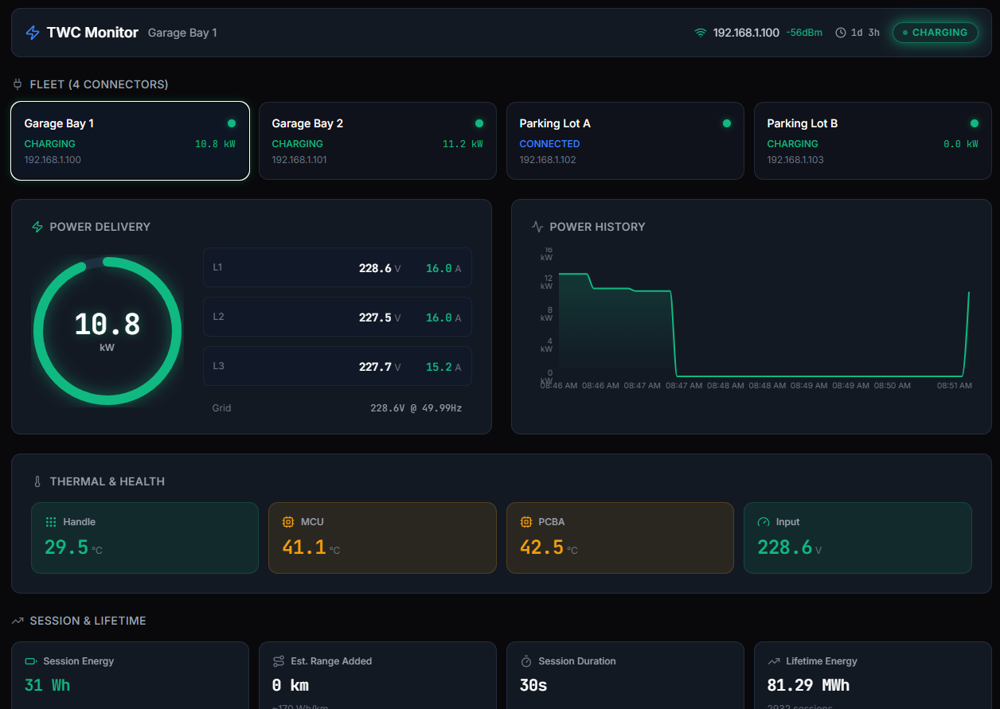

# Tesla Wall Connector Monitor

Monitor a fleet of Tesla Wall Connectors (Gen 3) and receive alerts via **WhatsApp** and/or **Telegram**.



## Features

- 🔌 **Fleet Monitoring** — Poll multiple Wall Connectors via local REST API
- 🚨 **9 Alert Types** — Offline, faults, temperature, power, charging events, grid anomalies
- 📱 **WhatsApp Notifications** — Via whatsapp-web.js (free, requires QR scan)
- 📬 **Telegram Notifications** — Via official Bot API (free, reliable)
- 📊 **Modern Web Dashboard** — Real-time fleet status with dark theme UI at `http://localhost:3000`
- 🗄️ **Alert History** — SQLite database with full alert and notification log
- 🐳 **Docker Ready** — docker-compose with persistent volumes
- 🧪 **Simulation Mode** — Test the dashboard and alerts without real hardware

## Dashboard

The dashboard is a modern React SPA with a dark "Tesla-inspired" theme, built with:

- **React 18** + **TypeScript** — Modular component architecture
- **Tailwind CSS** — Responsive mobile-first design with glassmorphism cards
- **Recharts** — Power history area charts
- **Lucide React** — Crisp lightweight icons

### Dashboard Sections

| Section | Description |
|---|---|
| **Header** | Connection health (WiFi signal/IP), device uptime, animated state badge (IDLE / CHARGING / FAULT) |
| **Fleet Selector** | Card grid to switch between multiple connectors (auto-hidden for single device setups) |
| **Power Delivery** | Real-time kW readout with SVG ring gauge, per-phase voltage/current (L1, L2, L3) |
| **Power History** | Area chart showing power delivery over the last ~5 minutes |
| **Thermal & Health** | Handle, MCU, PCBA temperatures + input voltage with conditional color coding (green/amber/red) |
| **Session & Lifetime** | Session energy (kWh), estimated range added (km), duration, lifetime energy (MWh) |
| **Recent Alerts** | Live alert feed with severity badges |
| **Alert Summary (24h)** | Aggregated alert counts by type and severity over the last 24 hours |

## Quick Start

### 1. Configure

```bash
cp config/config.example.yaml config/config.yaml
cp .env.example .env
```

Edit `config/config.yaml` with your Wall Connector IPs and notification settings.

### 2. Run with Docker

```bash
# Set your Telegram bot token in .env
echo "TELEGRAM_BOT_TOKEN=your-token-here" > .env

# Build and run
docker compose up -d
```

### 3. Run Locally (Development)

```bash
npm install
cd dashboard-ui && npm install && cd ..
npm run build
npm start
```

### 4. Development with Hot Reload

```bash
# Terminal 1 — Backend
npm run dev

# Terminal 2 — Frontend (with API proxy to backend)
npm run dev:ui
```

The frontend dev server runs on `http://localhost:5173` with hot reload and proxies API calls to the backend on port 3000.

### 5. Run in Simulation Mode (No Hardware Needed)

Simulation mode generates realistic fake connector data so you can test the dashboard, alerts, and notifications without physical Wall Connectors.

```bash
# Option A: Use the dev:sim script
npm run dev:sim

# Option B: Set environment variable
# Linux/macOS:
SIMULATE=true npm run dev
# Windows (PowerShell):
$env:SIMULATE="true"; npm run dev

# Option C: Enable in config/config.yaml
# simulation:
#   enabled: true
```

The simulator creates 4 virtual connectors (configurable) that cycle through states — idle, connected, charging, faults, offline — generating alerts as they transition. Open `http://localhost:3000` to see the dashboard in action.

## Project Structure

```
├── src/                    # Backend (Node.js + Express + TypeScript)
│   ├── index.ts            # Entry point
│   ├── dashboard/          # Express server, API endpoints, static file serving
│   ├── poller/             # TWC polling client and scheduler
│   ├── alerts/             # Alert detection engine
│   ├── notifications/      # WhatsApp & Telegram dispatchers
│   ├── storage/            # SQLite database layer
│   ├── simulator/          # Simulation mode (fake connector data)
│   └── types/              # TypeScript type definitions
├── dashboard-ui/           # Frontend (React + Vite + Tailwind CSS)
│   ├── src/
│   │   ├── App.tsx         # Main layout with device selection
│   │   ├── components/     # Header, HeroMetrics, ThermalGrid, etc.
│   │   ├── hooks/          # usePolling (auto-fetch every 5s)
│   │   └── lib/            # Types, utilities, formatters
│   ├── tailwind.config.js  # Custom dark theme colors & animations
│   └── vite.config.ts      # Vite config with API proxy
├── config/                 # YAML configuration
├── data/                   # SQLite database (auto-created)
└── docs/                   # Documentation & screenshots
```

## Configuration

### Wall Connectors

Each Wall Connector needs its local IP address. Your monitor must be on the same network.

```yaml
wall_connectors:
  - name: "Garage Bay 1"
    host: "192.168.1.100"
    enabled: true
```

**Finding the IP:** Check your router's DHCP client list, or use `nmap -sn 192.168.1.0/24`.

> **Note:** When simulation mode is enabled, `wall_connectors` can be empty — the simulator generates its own virtual connectors.

### Alert Thresholds

```yaml
alerts:
  temperature_warning_c: 70     # °C
  temperature_critical_c: 85
  max_power_kw: 11.5
  max_session_energy_kwh: 100
  grid_voltage_range: [210, 250]
  grid_frequency_range: [49.5, 50.5]
  offline_after_misses: 3
  cooldown_minutes: 15          # Prevents alert spam
```

### Notification Groups

Each group can use WhatsApp or Telegram and filter by alert type and severity:

```yaml
notification_groups:
  - name: "Maintenance Team"
    channel: "telegram"
    bot_token: "${TELEGRAM_BOT_TOKEN}"
    chat_id: "-1001234567890"
    alerts: ["device_offline", "charging_fault", "over_temperature"]
    severity_filter: "warning"

  - name: "All Alerts"
    channel: "whatsapp"
    group_id: "120363XXXXX@g.us"
    alerts: ["all"]
    severity_filter: "info"
```

### Simulation Settings

```yaml
simulation:
  enabled: false              # Set true or use SIMULATE=true env var
  connector_count: 4          # Number of simulated wall connectors
  scenario_interval_s: 60     # Seconds between scenario transitions per connector
  fault_probability: 0.15     # Probability of fault/anomaly scenarios (0.0–1.0)
```

**Scenarios** the simulator cycles through:
| Scenario | Description |
|---|---|
| `idle` | No vehicle connected |
| `vehicle_connected` | Vehicle plugged in, not yet charging |
| `charging` | Active charge session with current ramp-up |
| `charging_reduced` | Thermal throttling, reduced current |
| `over_temperature` | PCB/handle temp exceeding warning thresholds |
| `grid_anomaly` | Voltage/frequency outside normal range |
| `fault` | EVSE fault state |
| `offline` | Connector unreachable (simulates network loss) |

Each connector independently transitions between scenarios, so over time the dashboard will show a realistic mix of states and the alert table will populate with triggered alerts.

## Setting Up Telegram

1. Open Telegram and chat with [@BotFather](https://t.me/botfather)
2. Send `/newbot`, choose a name and username
3. Copy the bot token to your `.env` file
4. Add the bot to your group
5. Get the group chat ID:
   - Send a message in the group
   - Visit `https://api.telegram.org/bot<TOKEN>/getUpdates`
   - Find the `chat.id` (negative number like `-1001234567890`)

## Setting Up WhatsApp

1. Use a **dedicated phone number** (not your personal one)
2. Start the monitor — a QR code will appear in the terminal
3. Scan it with WhatsApp on your phone
4. The session is saved automatically (no re-scan needed on restart)
5. Get group IDs from the logs or dashboard

> ⚠️ **Warning:** whatsapp-web.js is unofficial. WhatsApp may restrict automated accounts. Use a dedicated number.

## Alert Types

| Alert | Severity | Trigger |
|---|---|---|
| `device_offline` | 🔴 Critical | Wall Connector unreachable |
| `charging_fault` | 🔴 Critical | EVSE error state |
| `over_temperature` | 🟡 Warning/Critical | Temp exceeds threshold |
| `high_power` | 🟡 Warning | Power draw above limit |
| `charging_started` | 🟢 Info | Charging session begins |
| `charging_completed` | 🟢 Info | Charging session ends |
| `session_energy` | 🟡 Warning | Session energy above limit |
| `grid_anomaly` | 🟡 Warning | Voltage/frequency out of range |
| `firmware_mismatch` | ℹ️ Info | Different firmware versions |

## API Endpoints

| Endpoint | Description |
|---|---|
| `GET /` | Web dashboard (React SPA) |
| `GET /api/devices` | Device states including vitals, lifetime, wifi data (JSON) |
| `GET /api/alerts?limit=50` | Recent alerts (JSON) |
| `GET /api/stats?hours=24` | Alert statistics grouped by type/severity (JSON) |
| `GET /api/power-history` | Power readings ring buffer, all devices (JSON) |
| `GET /api/power-history?host=<ip>` | Power readings for a specific device (JSON) |
| `GET /api/health` | Health check with uptime |

## Requirements

- Tesla Wall Connector **Gen 3** (with WiFi)
- Network access from monitor to Wall Connectors
- Node.js 20+ (or Docker)
- (Optional) Telegram bot token
- (Optional) Dedicated WhatsApp number

## License

MIT
